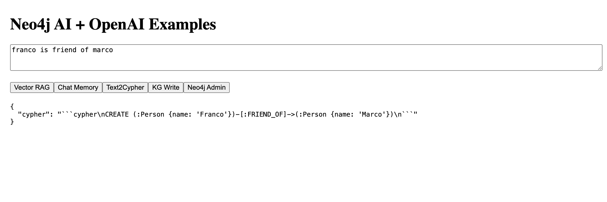

# Vercel Neo4j AI + OpenAI

Includes examples:
- Vector RAG (semantic search)
- Chat memory with OpenAI
- Text2Cypher with OpenAI
- Knowledge graph write
- Neo4j admin query
- Simple frontend to test all endpoints

## Setup

1. Copy `.env.example` to `.env` and set your `OPENAI_API_KEY`
2. Start Neo4j locally or in the cloud
3. Install dependencies:
```bash
   npm install
```

4. Start the development server:

```bash
   npm run dev
```

## How It Works

Once the server is running, open [http://localhost:3000](http://localhost:3000).
You will see a simple interface with:

* **Textarea**: type your query or message
* **Buttons**: six buttons to trigger different API endpoints
* **Output area**: shows the JSON response from the backend

### Button Functionality

| Button              | Endpoint           | Description                                                                                                                  |
| ------------------- | ------------------ | ---------------------------------------------------------------------------------------------------------------------------- |
| **Vector RAG**      | `/api/vector-rag`  | Performs a semantic search on documents stored in Neo4j. Uses OpenAI embeddings to return the top-K most relevant documents. |
| **Chat Memory**     | `/api/chat-memory` | Sends a message, saves it in Neo4j, and generates a response with OpenAI Chat using the conversation history.                |
| **Text2Cypher**     | `/api/text2cypher` | Converts natural language input into a Neo4j Cypher query using OpenAI Chat.                                                 |
| **KG Write**        | `/api/kg-write`    | Writes a triple (subject - relation - object) into the Neo4j knowledge graph.                                                |
| **Neo4j Admin**     | `/api/neo4j-admin` | Executes any Cypher query on Neo4j and returns the result.                                                                   |
| **(Optional Chat)** | `/api/chat`        | Generic chat interface using OpenAI.                                                                                         |

### Usage

1. Type your input in the textarea:

   * Vector RAG: type a search query for your documents
   * Chat Memory: type a message to the bot
   * Text2Cypher: type a natural language command, e.g. `Create a person named John`
   * KG Write: type a triple, e.g. `Alice KNOWS Bob`
   * Neo4j Admin: type any Cypher query, e.g. `MATCH (n) RETURN n LIMIT 5`
2. Click the corresponding button.
3. Check the output area for the response.

### Example

* **Vector RAG**: `What is GraphRAG?` → returns top-K similar documents
* **Chat Memory**: `Hi!` → saves message in Neo4j → OpenAI generates reply
* **Text2Cypher**: `Create a person named John` → returns:

  ```cypher
  CREATE (:Person {name:'John'})
  ```

### Backend Flow

1. Frontend sends request to the selected API endpoint
2. Backend may interact with Neo4j (read/write data)
3. Backend may call OpenAI via `ai@6.x` + `@ai-sdk/openai` for embeddings or chat
4. Response is returned as JSON → displayed in the frontend





### Vector Stores

We should implement examples like these:

* [https://vercel.com/templates/next.js/postgres-pgvector](https://vercel.com/templates/next.js/postgres-pgvector)
* [https://vercel.com/docs/ai/pinecone](https://vercel.com/docs/ai/pinecone)
* [https://vercel.com/templates/next.js/upstash-vector-vercel-ai-sdk-starter](https://vercel.com/templates/next.js/upstash-vector-vercel-ai-sdk-starter)
* [https://vercel.com/kb/guide/understanding-vector-databases-for-ai-apps](https://vercel.com/kb/guide/understanding-vector-databases-for-ai-apps)

Some examples can be found here:

* [https://github.com/vercel/examples/tree/main](https://github.com/vercel/examples/tree/main)

For instance, similar to:

* [https://github.com/vercel/examples/tree/main/storage/postgres-pgvector](https://github.com/vercel/examples/tree/main/storage/postgres-pgvector)

At the moment, it does **not** seem possible to have a first-class abstraction similar to `Neo4jEmbeddingStore` from LangChain4j.

The **only vector database directly supported and integrated by Vercel** is **Upstash Vector**, via:

* `@vercel/ai-vector-store-upstash`

All other vector databases are provided **only as reference examples or templates**, not as built-in SDK abstractions.

Relevant links:

* [https://vercel.com/marketplace/upstash](https://vercel.com/marketplace/upstash)
* [https://vercel.com/templates/next.js/upstash-vector-vercel-ai-sdk-starter](https://vercel.com/templates/next.js/upstash-vector-vercel-ai-sdk-starter)

